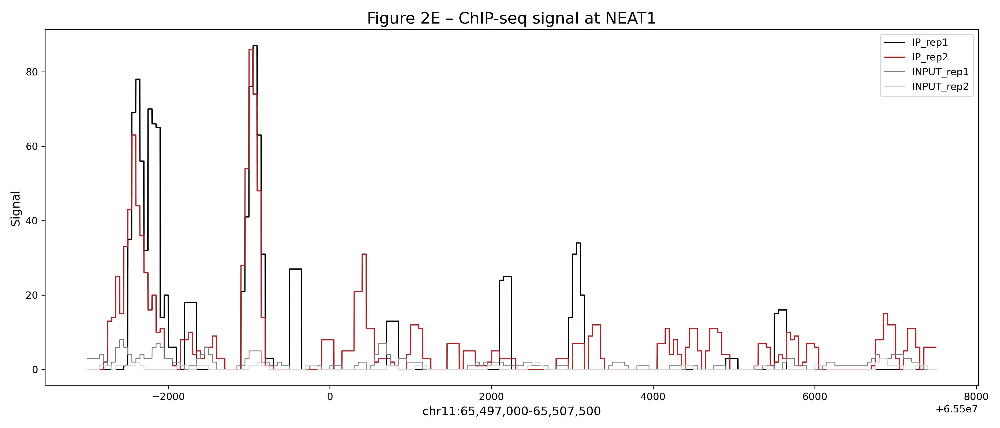

# RUNX1 ChIP-seq Analysis

## Overview

This project investigates how RUNX1 regulates chromatin structure and gene expression in breast cancer cells using ChIP-seq and RNA-seq data.

## Workflow

* Quality control: FastQC, MultiQC
* Alignment: Bowtie2
* Processing: SAMtools, deepTools
* Peak calling: HOMER
* Pipeline: Nextflow

## Key Findings

* Strong enrichment of RUNX-family motifs
* Reproducible binding at MALAT1 and NEAT1 loci
* RUNX1 binding associated with both up- and down-regulated genes

## Example Results



## How to Run

```bash
conda env create -f week4_analysis.yml
nextflow run main.nf
```

## Data

GEO: GSE75070 (subsampled for analysis)

## Author

Christine Snow
